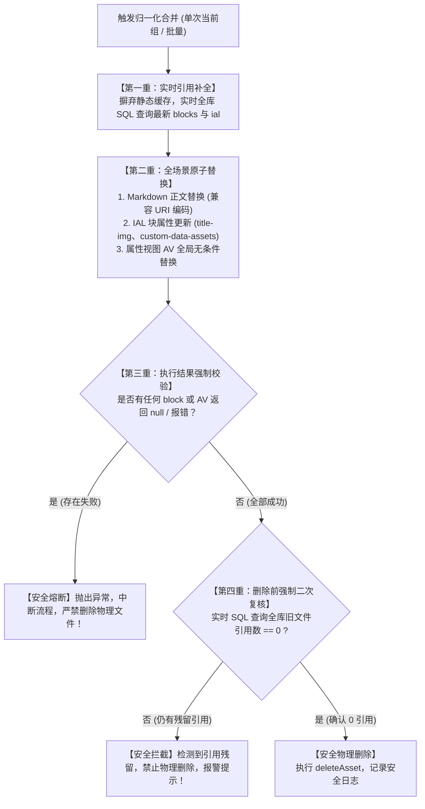

# 图片去重与归一化安全优化方案与实施计划

更新日期：2026-09-20  
状态：实施方案与安全加固规范

---

## 一、问题定性：单次“合并当前组”与批量归一化的同类风险分析

### 1. 结论：单次“合并当前组”完全存在同样的资产丢失风险！
经代码对比分析，单次操作与批量操作在底层**完全共享同一套核心执行函数**：
- 单次“合并当前组”：[`DeduplicateDialog.vue::handleMergeCurrentGroup`](file:///d:/MyCodingProjects/siyuan-assets-manager/src/components/DeduplicateDialog.vue) -> 直接调用 [`deduplicate.ts::normalizeDuplicateGroup`](file:///d:/MyCodingProjects/siyuan-assets-manager/src/utils/deduplicate.ts#L601)；
- “一键批量归一化”：[`DeduplicateDialog.vue::handleBatchMerge`](file:///d:/MyCodingProjects/siyuan-assets-manager/src/components/DeduplicateDialog.vue#L728) -> 遍历调用 [`deduplicate.ts::batchNormalizeDuplicateGroups`](file:///d:/MyCodingProjects/siyuan-assets-manager/src/utils/deduplicate.ts#L677) -> 内部循环执行 [`normalizeDuplicateGroup`](file:///d:/MyCodingProjects/siyuan-assets-manager/src/utils/deduplicate.ts#L601)。

因此，导致用户反馈“文档中引用的资源丢失/变红叉”的**全部底层缺陷，在单次合并时完全同等生效**：
1. **持久化缓存导致新文档引用被漏替**：单次合并若是从历史缓存加载的组，引用的同样是扫描那一刻的静态 `BlockRef[]`，扫描后新写文档引用的该图片直接被漏掉并被删除；
2. **文档题头图（Cover / `title-img`）未更新**：调用同样的 `replaceAssetInBlocks`，依然只更新正文 `markdown`，根块的封面属性被跳过，随后物理删除原图导致封面丢失；
3. **URI 编码前置短路**：包含中文或编码路径的图片，被 `currentMarkdown.includes` 提前短路，未执行替换即物理删除；
4. **属性视图（AV）在 `refs.length === 0` 时被绕过**：仅在数据库中引用的冗余文件，单次合并同样会因为正文引用为 0 而跳过 AV 替换，直接强删物理文件；
5. **更新失败静默吞掉与缺乏前置复核**：`updateBlock` 失败返回 `null` 未被捕获，删除前缺乏实时 0 引用复核，物理删除强行执行。

---

## 二、架构级安全加固设计

为彻底终结资源丢失隐患，设计如下**四重安全防护架构**：



---

## 三、详细优化方案与改造规范

### 1. 动态全库最新引用查询（解决缓存过期漏替）
- **新建方法**：`queryCurrentAssetBlockReferences(assetName: string): Promise<BlockRef[]>`
- **实现逻辑**：
  在执行 `normalizeDuplicateGroup` 时，不再轻信静态 `redundant.references`，而是以此为基础，并行执行一次实时的全库 SQL 查询：
  ```sql
  SELECT id, root_id, box, content, markdown, path, hpath, ial 
  FROM blocks 
  WHERE markdown LIKE '%assets/' || ? || '%' 
     OR markdown LIKE '%assets/' || ? || '%' 
     OR ial LIKE '%assets/' || ? || '%' 
     OR ial LIKE '%assets/' || ? || '%'
  ```
  （参数为原始名与 `encodeURIComponent` 编码名）。
- **效果**：合并前无论用户在分析后新增了多少篇文档引用该图片，全部实时捕获并无一遗漏地加入待替换队列。

---

### 2. 块属性 IAL 原子替换支持（解决文档题头图/封面图丢失）
- **修改模块**：[`src/utils/siyuan-block.ts::replaceAssetInBlocks`](file:///d:/MyCodingProjects/siyuan-assets-manager/src/utils/siyuan-block.ts#L31)
- **实现逻辑**：
  在遍历块时，检查 `block.ial`：
  若包含 `oldAssetName` 或其编码，调用 `getBlockAttrs(ref.id)`：
  1. 若属性中存在 `title-img`，提取其 CSS `url(...)` 中的旧资源名，替换为新资源名；
  2. 若存在 `custom-data-assets` 等自定义属性，同步替换为新资源名；
  3. 调用 `setBlockAttrs(ref.id, updatedAttrs)` 并校验返回结果；
  4. 若调用失败，立即抛错中止。

---

### 3. 正文替换健壮性与失败熔断机制（解决更新失败仍强删文件）
- **放宽匹配条件**：将 `currentMarkdown.includes('assets/' + oldAssetName)` 扩展为同时检测原始名与 URI 编码名，彻底杜绝中文文件名被提前短路；
- **失败严密捕获**：
  检查 `await updateBlock("markdown", newMarkdown, ref.id)` 的返回状态。若返回 `null` 或返回非成功代码，直接抛出 `Error(`[去重归一化] 更新文档块 ${ref.id} 失败`)`，坚决不允许执行后续删除。

---

### 4. 属性视图（AV）替换无条件执行（解决仅在数据库中引用的图片裂开）
- 将 `replaceAssetInAttributeViews` 的调用提取为**必选前置步骤**；
- 无论正文是否有普通 Markdown 引用，只要执行归一化，属性视图全局扫描与更新必须执行并校验。

---

### 5. 删除前“生死线二次安全复核”（Pre-delete Double Check）
- 在 `normalizeDuplicateGroup` 执行 `await deleteAsset(redundant.name)` 之前，增加强校验拦截：
  ```ts
  const remainingRefs = await queryCurrentAssetBlockReferences(redundant.name);
  if (remainingRefs.length > 0) {
    throw new Error(`[安全拦截] 资源 [${redundant.name}] 尚有 ${remainingRefs.length} 处文档引用未完成替换，已终止删除该文件！`);
  }
  ```
- 只要库中检测到任何一处引用未替换完成，物理文件绝对不删，彻底杜绝裂图与资源丢失。

---

### 6. 视觉相似（Similar）一键合并交互安全防护
- 在 [`DeduplicateDialog.vue`](file:///d:/MyCodingProjects/siyuan-assets-manager/src/components/DeduplicateDialog.vue) 中：
  - 精确模式（Exact）：保持“一键批量归一化”功能；
  - 视觉相似模式（Similar）：增加醒目的风险提示 Banner，文案明确告知“相似图片合并后被替换的图片将被删除”，避免用户未核对即误点。

---

## 四、实施计划

### 第一阶段：底层块操作与属性替换安全升级
- 修改 [`src/utils/siyuan-block.ts`](file:///d:/MyCodingProjects/siyuan-assets-manager/src/utils/siyuan-block.ts)：
  1. 新增 `queryCurrentAssetBlockReferences` 实时查询函数；
  2. 在 `replaceAssetInBlocks` 中增加对 IAL（`title-img` 及自定义属性）的提取与 `setBlockAttrs` 更新；
  3. 兼容 URI 编码的链接检测，增加 `updateBlock` 与 `setBlockAttrs` 严格返回值校验与失败抛错。

### 第二阶段：去重核心服务层（deduplicate.ts）加固
- 修改 [`src/utils/deduplicate.ts`](file:///d:/MyCodingProjects/siyuan-assets-manager/src/utils/deduplicate.ts)：
  1. 在 `normalizeDuplicateGroup` 中引入实时全库引用拉取，覆盖陈旧缓存；
  2. 将属性视图更新提升为无条件执行；
  3. 在 `deleteAsset` 之前引入 `Pre-delete Double Check` 二次复核机制。

### 第三阶段：前端对话框（DeduplicateDialog.vue）安全优化
- 优化批量归一化针对视觉相似（Similar）模式的风险提示与交互防护。

### 第四阶段：单元测试与全量构建验证
- 新增针对 IAL 封面图替换、实时引用查库、删除前安全拦截熔断的单元测试；
- 运行 `npm test` 与 `npm run build`，确保全部测试通过。
