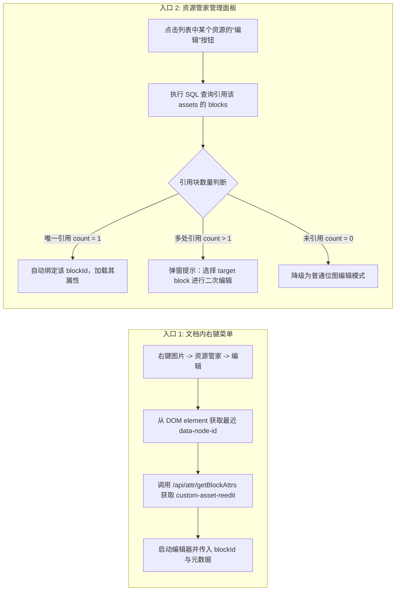

# 基于思源块自定义属性的图片二次编辑技术方案

## 1. 方案背景与目标

### 1.1 现状与痛点
当前 `siyuan-assets-manager` 插件集成了 `tui-image-editor` 进行图片标注与编辑。现有流程中：
- 编辑完成后，画布被整体导出并“烘焙（Bake）”压平成一张位图图片（PNG/JPG）覆盖或保存到 `data/assets/`；
- 所有添加的箭头、文字、矩形等标注元素均已固化为像素，无法进行二次修改、移动或删除；
- 再次打开编辑时只能在已有标注的基础上继续涂画，或只能重新插入原图从头制作。

### 1.2 参考与改进策略
参考 `siyuan-plugin-imgReEditor` 的二次编辑思想，并针对当前项目的特性进行架构升级：
- **不采用原图 PNG `tEXt` 内嵌**：避免因嵌入原图 Base64 导致图片体积膨胀 1.5~2 倍，避免外部图片压缩工具破坏元数据。
- **采用思源块自定义属性（Custom Block Attribute）**：将矢量图层数据（JSON）保存在思源笔记对应图像块的自定义属性（`custom-asset-reedit`）中。
- **原始底图隔离保护**：将未修改的干净原始底图存放在插件专属存储路径（`data/storage/petal/siyuan-assets-manager/originals/`），既彻底规避思源原生“清理未引用资源”对 `data/assets/` 的误删风险，又保证二次编辑时底图无重影。
- **资源管家专项管理**：在插件主界面增加对这类原始底图的专项管理、引用反查与孤立清理能力。

---

## 2. 系统架构与数据流设计

### 2.1 整体数据流图

```mermaid
flowchart TD
    subgraph EditSave [首次编辑与保存流程]
        A1[用户打开图片编辑] --> A2[加载底图到 TUI Editor]
        A2 --> A3[用户添加箭头/文字/矩形标注]
        A3 --> A4[点击保存]
        A4 --> B1[1. 复制/移动原始底图到 storage/originals/]
        A4 --> B2[2. 导出压平位图到 data/assets/xxx-edited.png]
        A4 --> B3[3. 提取 Fabric Canvas 矢量图层 JSON]
        B3 --> B4[4. 阈值自适应压缩 lz-string]
        B1 & B2 & B4 --> C1[5. 调用 /api/attr/setBlockAttrs 写入图像块属性]
        C1 --> C2[6. 更新图像块 Markdown 引用新生成的 assets 路径]
    end

    subgraph ReEdit [二次编辑与还原流程]
        D1[用户在文档右键点击编辑 / 从资源管家打开] --> D2[读取图像块属性 custom-asset-reedit]
        D2 --> D3{是否存在二次编辑元数据?}
        D3 -->|存在| E1[从 storage/originals/ 读取干净底图]
        E1 --> E2[初始化 TUI Editor 并加载干净底图]
        E2 --> E3[解压并注入 vectorData 到 Fabric Canvas]
        E3 --> E4[恢复所有标注为可交互/可选中矢量状态]
        D3 -->|不存在| F1[常规模式：直接加载当前 assets 图片]
    end
```



---

## 3. 核心数据模型与自定义属性规范

### 3.1 块自定义属性名称
思源笔记块自定义属性需以 `custom-` 开头：
- **属性名**：`custom-asset-reedit`

### 3.2 元数据 JSON 结构定义
```typescript
export interface IAssetReEditMetadata {
  /** 元数据协议版本号 */
  version: number;
  /** 插件专属存储目录中的原始底图相对路径 */
  originalStoragePath: string;
  /** 原始底图的 SHA256 / Hash 校验（可选，用于一致性校验） */
  originalHash?: string;
  /** 当前渲染输出的 assets 文件名（如 foo-edited-20260815.png） */
  renderedAssetName: string;
  /** 标注所在的原始画布/图片尺寸 */
  canvasSize: {
    width: number;
    height: number;
  };
  /** 是否使用了 lz-string 压缩 */
  compressed: boolean;
  /** 
   * 矢量图层数据（Fabric.js JSON 对象或 lz-string 压缩字符串）
   * 注意：严禁在 vectorData 中塞入底图 Base64，仅包含矢量元素（objects）
   */
  vectorData: any | string;
  /** 最后更新时间戳 */
  updatedAt: number;
}
```

### 3.3 阈值自适应压缩策略
为保证思源 SQLite 数据库性能与 `.sy` 文件的轻量性：
- 序列化 `vectorData` 为 JSON 字符串后，若长度 **< 2KB**，以明文 JSON 存储（`compressed: false`），方便调试和人类可读；
- 若长度 **>= 2KB**，采用 `lz-string` 编码为紧凑字符串（`compressed: true`），体积可进一步压缩 60%~75%。

---

## 4. 关键技术实现要点

### 4.1 TUI Image Editor 与 Fabric Canvas 桥接
`tui-image-editor` 内部基于 Fabric.js 实现图形绘制。为了实现无损序列化与反序列化，需封装底层 Canvas 访问：

#### 1. 抽取矢量标注数据（Serialization）
```typescript
/**
 * 从 TUI Image Editor 实例中抽取纯矢量标注图层（排除底图）
 */
export function extractVectorDataFromTui(editorInstance: any): any {
  if (!editorInstance) return null;
  
  // 获取 TUI 内部包装的 Fabric Canvas 实例
  const fabricCanvas = editorInstance._graphics?._canvas || (editorInstance as any).getCanvas?.();
  if (!fabricCanvas) return null;

  // 定义需保留的自定义与关键交互属性
  const SERIALIZE_PROPERTIES = [
    'id', 'selectable', 'evented', 'stroke', 'strokeWidth', 'fill',
    'fontSize', 'fontFamily', 'fontWeight', 'text', 'textAlign',
    'left', 'top', 'width', 'height', 'scaleX', 'scaleY', 'angle',
    'arrowType', 'markerNumber', 'opacity', 'rx', 'ry'
  ];

  // 导出所有对象（排除背景图，避免将整张大图 Base64 塞入 JSON）
  const canvasJson = fabricCanvas.toObject(SERIALIZE_PROPERTIES);
  
  return {
    objects: canvasJson.objects || [],
    version: canvasJson.version
  };
}
```

#### 2. 注入矢量标注并恢复可编辑状态（Deserialization）
```typescript
/**
 * 将矢量标注图层恢复注入到 TUI Canvas 中
 */
export async function applyVectorDataToTui(editorInstance: any, vectorData: any): Promise<void> {
  if (!editorInstance || !vectorData) return;

  const fabricCanvas = editorInstance._graphics?._canvas;
  if (!fabricCanvas) return;

  // 1. 清空除 background 以外的历史矢量对象
  const existingObjects = fabricCanvas.getObjects();
  for (const obj of existingObjects) {
    if (obj !== fabricCanvas.backgroundImage) {
      fabricCanvas.remove(obj);
    }
  }

  // 2. 利用 fabric.util.enlivenObjects 批量实例化并添加对象
  return new Promise((resolve) => {
    (window as any).fabric.util.enlivenObjects(vectorData.objects, (enlivenedObjects: any[]) => {
      enlivenedObjects.forEach((obj) => {
        obj.set({
          selectable: true,
          evented: true,
          hasControls: true,
          hasBorders: true
        });
        fabricCanvas.add(obj);
      });
      fabricCanvas.renderAll();
      resolve();
    });
  });
}
```

---

### 4.2 双入口交互与文档块绑定逻辑



#### 块属性读写封装 API
在 `src/utils/siyuan-block.ts` 中新增针对二次编辑属性的高阶封装：
- `getImageBlockReEditData(blockId: string): Promise<IAssetReEditMetadata | null>`
- `setImageBlockReEditData(blockId: string, metadata: IAssetReEditMetadata): Promise<boolean>`
- `removeImageBlockReEditData(blockId: string): Promise<boolean>`

---

### 4.3 原始底图生命周期与资源管家“专项管理”

#### 1. 存储目录结构
```text
data/
├── assets/                                      <-- 思源标准资源目录（只放导出的最终渲染图）
│   ├── image-20260815-abc1234.png
│   └── image-20260815-abc1234-annotated.png
└── storage/
    └── petal/
        └── siyuan-assets-manager/
            └── originals/                       <-- 插件隔离存储目录（原生清理绝对扫不到）
                ├── 8f3a9b1c-image-20260815-abc1234.png
                └── ...
```

#### 2. 资源管家管理面板中的专项视图
在 `src/components/AssetsManager.vue` 界面中：
1. **二次编辑状态标记**：
   - 资产列表表格/卡片中，若某张图片对应的块含有 `custom-asset-reedit` 属性，在其名称旁边展示蓝色的 `[可二次编辑]` 徽标（Badge）。
2. **“原始底图”专属管理页签（Tab / Filter）**：
   - 增加筛选器选项：`全部资源` / `可二次编辑资源` / `二次编辑原始底图`。
   - 列出 `storage/.../originals/` 目录中的所有底图文件，展示文件大小、创建时间、关联的文档块 ID 及文档标题。
3. **孤立原始底图清理（Orphan Originals Cleanup）**：
   - 当用户在思源文档中删除了某个含有二次编辑属性的图片块时，`storage/.../originals/` 下对应的底图会变为无引用状态。
   - 插件提供一键**“扫描并清理无主原始底图”**功能（通过校验其关联的 blockId 是否在 `blocks` 表中存在），彻底释放存储空间。

---

## 5. UI / UX 规范与交互细节

1. **右键菜单视觉反馈**：
   - 当图片块已有二次编辑数据时，菜单显示为：`资源管家 -> 编辑标注（已含历史标注）`；
   - 当图片块为普通图片时，菜单显示为：`资源管家 -> 编辑标注`。
2. **编辑器弹窗指示**：
   - 在 `ImageEditorDialog.vue` 顶部标题栏展示：`编辑图片: foo.png (二次编辑模式)`，并提供快捷按钮：
     - **“重置为原始底图”**：一键清空当前所有矢量标注，恢复干净底图。
     - **“合并固化图层”**：如果用户确认不再需要二次编辑，可一键移除块属性，将其降级为普通图片。
3. **保存动作的透明反馈**：
   - 点击“保存”后，底部状态栏即时提示：`“已保存标注并更新文档块 (矢量数据: 1.2 KB)”`。

---

## 6. 实施路线图与任务分解

| 阶段 | 任务项 | 涉及文件 | 交付物 / 验收标准 |
| :--- | :--- | :--- | :--- |
| **Phase 1** | **底层基础设施与数据模型** | `src/types/reedit.d.ts`<br>`src/utils/reedit-data.ts`<br>`tests/reedit-data.test.ts` | 1. 定义数据结构与类型定义；<br>2. 实现 `lz-string` 自适应压缩/解压与单元测试。 |
| **Phase 2** | **TUI / Fabric 序列化桥接** | `src/utils/tui-image-editor-bridge.ts`<br>`src/utils/image-editor.ts` | 1. 实现 `extractVectorDataFromTui` 纯矢量提取；<br>2. 实现 `applyVectorDataToTui` 矢量反序列化。 |
| **Phase 3** | **底图隔离存储与块属性读写** | `src/utils/file-system.ts`<br>`src/utils/siyuan-block.ts` | 1. 实现 `originals/` 目录的读写与安全复制；<br>2. 封装 `getBlockAttrs` 与 `setBlockAttrs` 操作。 |
| **Phase 4** | **编辑器组件改造与双入口适配** | `src/components/ImageEditorDialog.vue`<br>`src/index.ts`<br>`src/App.vue` | 1. 右键菜单传递 `blockId`；<br>2. 编辑器支持传入底图与 `vectorData` 自动还原；<br>3. 保存时联动更新文件、块 Markdown 与块属性。 |
| **Phase 5** | **资源管家面板“原始底图管理”** | `src/components/AssetsManager.vue`<br>`src/utils/siyuan-db.ts` | 1. 列表展示 `[可二次编辑]` 徽标；<br>2. 增加原始底图查看与孤立底图清理功能。 |
| **Phase 6** | **全面回归测试与文档刷新** | `tests/*.test.ts`<br>`docs/project-structure.md`<br>`README_zh_CN.md` | 1. 单元测试全绿；<br>2. `npm run build` 打包验证；<br>3. 刷新项目说明文档。 |
