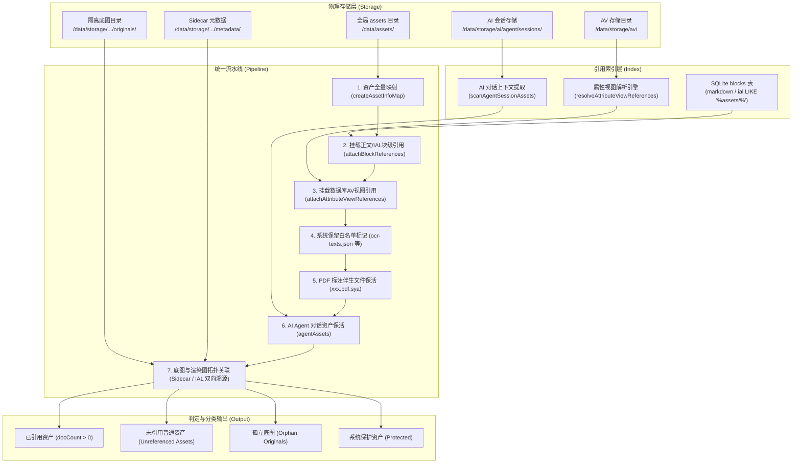
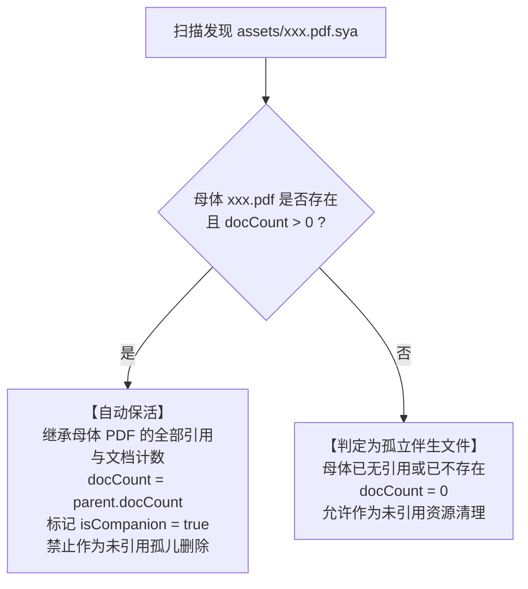

# 未引用资源与孤儿底图识别设计方案与判定规范

更新日期：2026-09-20  
版本：v1.2.0  
状态：已实现（已对齐思源官方内核未引用规则）

---

## 一、背景与设计目标

在思源笔记的长期使用中，`assets/` 资源目录膨胀严重（图片、PDF、音视频、压缩包等）。传统的纯文件名简单搜索容易产生大量误删风险：
1. **误删高风险附件**：思源 PDF 批注的高亮划线保存于 `.pdf.sya` 伴生文件中；正文中通常只引用母体 `xxx.pdf`，直接按字面检索会导致 `.sya` 批注全被当作未引用文件删空；
2. **误删系统核心索引**：全局 OCR 文本保存在 `data/assets/ocr-texts.json` 中，若无针对性白名单防护，一键清理将彻底破坏全局图片搜索；
3. **富文本与新特性盲区**：文档题头图（Cover / `title-img`）、属性视图（AV 数据库）列数据、思源内置 AI Agent 会话图片、PDF 锚点引用等场景若未覆盖，极易将正在使用的文件误判为孤儿；
4. **矢量二次编辑底图孤立**：插件特有的隔离底图（`/data/storage/petal/siyuan-assets-manager/originals/`）需与渲染图、文档引用建立拓扑联动，既要防止底图误删，又要能精准识别废弃底图。

**本方案目标**：构建与思源笔记官方内核（`kernel/model/assets.go::UnusedAssets`）深度对齐、兼顾插件矢量二次编辑底图特性的全生命周期未引用资源识别引擎。

---

## 二、总体架构与数据装配拓扑

未引用判定引擎采用**统一领域目录流水线**（`resolveCatalogPipeline`），整合多维数据源，生成具有双向引用拓扑的资产清单：



---

## 三、引用的识别规则与判定条件

一个资产只有在**所有可能的引用场景中均为 0 引用**，且**不属于系统受保护文件**时，才会被判定为未引用资源。

### 1. 正文内容与 Markdown 链接
- **标准括号链接**：`[text](assets/name.ext)`、``；
- **HTML 媒体标签**：``、`<video src="...">`、`<audio src="...">`、`<iframe src="...">`；
- **裸路径与自动链接**：`assets/name.ext` 独立成词或通过空格、标点分隔；
- **URL 编码兼容**：同时比对原始名称与 `encodeURIComponent` 编码形式（如 `测试.png` 与 `%E6%B5%8B%E8%AF%95.png`）；
- **参数剥离**：自动剥离 URL Query 与 Hash 参数（如 `assets/doc.pdf?page=2#anchor` -> `doc.pdf`）。

### 2. 文档题头图与 CSS 样式（Cover）
- **块属性 IAL 题头图**：思源在文档根块的 `title-img` 属性中记录封面；
- **实体反转义**：预处理 `&quot;`、`&#39;`、`&apos;`，提取形如 `title-img="background-image: url(&quot;assets/cover.png&quot;)"` 中的资源；
- **CSS `url(...)` 提取器**：兼容单引号、双引号、无引号及 `/data/assets/` 前缀写法：
  ```regex
  url\(\s*(?:['"]?)(?:(?:\/data\/)?assets\/)([^'")]+)(?:['"]?)\s*\)
  ```

### 3. PDF 标注引用拆解（对齐官方 `util.SplitFileAnnotationRef`）
- **批注锚点语法**：
  - `<span data-type="file-annotation-ref" data-id="assets/book.pdf/20240101000000-abcdefg">`
  - `<<assets/book.pdf/20240101000000-abcdefg "annotation">>`
- **拆解逻辑**：
  路径末尾符合 `/<node-id>` 且前半部分以 `.pdf` 结尾时，自动剥离批注 ID，精准将母体 `book.pdf` 计入文档引用。

### 4. 属性视图（Attribute View / 数据库）
- **结构化解析**：遍历 `data/storage/av/*.json` 文件，解析 `mAsset` 资源列、`url` 链接列以及单元格富文本；
- **双向宿主关联**：查询 `type = 'av'` 的数据库嵌入块，将数据库列中的资源反查到宿主文档路径；
- **全文保底正则**：对属性视图 JSON 原始内容执行兜底扫描，确保自定义扩展字段或关系列（Relation/Rollup）无一遗漏。

### 5. 自定义块属性与 Widget 组件
- 支持块属性中以 `custom-data-assets` 开头的值；
- 支持挂件（Widget）块的 `custom-data-assets` 与 `data-assets` 属性。

### 6. 思源内置 AI Agent 会话历史
- 异步扫描 `/data/storage/ai/agent/sessions/` 目录；
- 读取 `session.json` 与 `runtime.json` 中的对话上下文，提取用户临时上传给 AI 识别的图片并保活。

---

## 四、伴生文件与系统文件的保活规范

### 1. PDF 伴生标注文件（`.pdf.sya`）联动保护
PDF 批注文件包含划线、高亮与手写笔记，正文中不会直接出现 `.pdf.sya` 路径。判定逻辑如下：



### 2. 系统核心保留文件白名单（`SYSTEM_PROTECTED_ASSETS`）
以下文件由思源笔记内核用于关键功能，**无论是否有文档引用，绝对禁止作为孤儿删除**：
- `ocr-texts.json`：全局 OCR 图像文字识别缓存索引；
- `android-notification-texts.txt`：移动端通知推送历史文件。

在代码中通过三层防御进行绝对保护：
1. **视图层**：在“未引用”筛选视图中自动隐藏；
2. **统计层**：在 `calculateUnreferencedCleanup` / `calculateTotalCleanup` 中强制过滤；
3. **执行层**：在 `deleteAssetFile` 底层调用中进行拦截抛错。

### 3. 操作系统临时垃圾与隐藏文件过滤（`isIgnoredSystemAsset`）
- 过滤以 `.` 开头的隐藏文件（如 `.DS_Store`、`.git`、`.gitignore`）；
- 过滤 Windows/macOS 垃圾文件（`Thumbs.db`、`desktop.ini`、`$RECYCLE.BIN`）；
- 目录录入阶段自动跳过，不纳入资产库，避免污染视图。

---

## 五、判定状态矩阵

| 资源类型 | 核心判定条件 | 归属分类 | 处理动作 |
|---|---|---|---|
| **常规正文资源** | `docCount > 0` | 已引用资源 | 正常展示，显示关联文档与块路径 |
| **常规未引用资源** | `!isOriginal && !isSystemProtected && docCount === 0` | 未引用普通资产 | 纳入孤儿清理列表，支持一键安全删除 |
| **PDF 母体文件** | 通过正文链接或 PDF 标注锚点被引用 (`docCount > 0`) | 已引用资源 | 正常保护 |
| **PDF 伴生文件 (`.sya`)** | 母体 `xxx.pdf` 的 `docCount > 0` | 伴生受保护文件 | 自动继承母体引用，绝不纳入孤儿列表 |
| **孤立 PDF 伴生文件** | 母体 `xxx.pdf` 不存在或其 `docCount === 0` | 未引用普通资产 | 允许清理 |
| **二次编辑底图 (有效)** | 其渲染图 `renderedAssetName` 在文档中有引用 | 有效隔离底图 | 受保护，支持无损二次编辑还原 |
| **二次编辑底图 (孤立)** | 渲染图已无引用或已从 assets 中删除 (`docCount === 0`) | 孤立底图 (Orphan) | 纳入“孤立底图清理”列表，释放隔离区空间 |
| **系统保留文件** | 文件名在 `SYSTEM_PROTECTED_ASSETS` 白名单内 | 系统保护文件 | 列表打标 `isSystemProtected`，三层防线禁止删除 |

---

## 六、关键代码路径与职责速查

| 功能模块 | 代码文件 | 核心函数 / 职责 |
|---|---|---|
| **Markdown 语法解析** | `src/utils/asset-markdown.ts` | `extractAssetNamesFromMarkdown`：支持常规链接、HTML 媒体、CSS `url(...)`、PDF 标注拆解与 HTML 实体反转义 |
| **路径替换与重命名** | `src/utils/asset-markdown.ts` | `replaceAssetInMarkdown`：断言支持 `/` 结尾，确保 PDF 重命名时标注锚点子路径平滑联动 |
| **领域装配流水线** | `src/utils/asset-catalog.ts` | `resolveCatalogPipeline`：统一融合物理文件、块引用、AV 引用、PDF 伴生保活、底图拓扑与系统白名单 |
| **系统白名单与底层拦截** | `src/utils/siyuan-db.ts` | `SYSTEM_PROTECTED_ASSETS` 白名单常量；`deleteAssetFile` 抛错硬拦截 |
| **清理统计与分类过滤** | `src/utils/asset-list.ts` | `filterAssets` 与 `calculateTotalCleanup`：严格排除受保护文件与伴生保活文件 |
| **AI 会话资产扫描** | `src/utils/asset-catalog.ts` | `scanAgentSessionAssets`：安全异步扫描 AI Agent 历史会话中的图片 |
