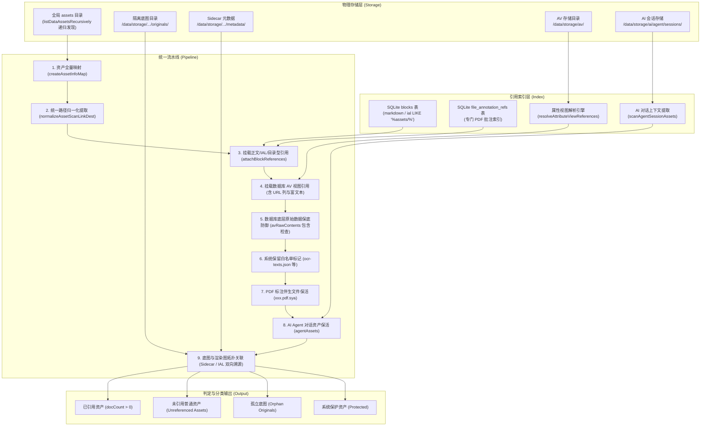
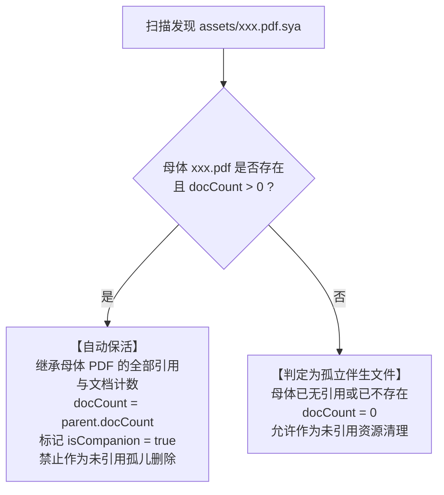

# 未引用资源与孤儿底图识别设计方案与判定规范

更新日期：2026-10-02
版本：v1.2.2
状态：已实现（深度对齐思源笔记官方内核未引用资源增强判定规范）

---

## 一、背景与设计目标

在思源笔记的长期使用中，`assets/` 资源目录膨胀严重（图片、PDF、音视频、压缩包等）。传统的纯文件名简单搜索容易产生严重误删或漏判风险：
1. **多级相对导航与前缀路径漏网**：在 HTML 块、富文本或复制迁移的文档中，本地资源经常以 `/assets/xxx`（根绝对路径）、`./assets/xxx`（当前相对路径）、`../assets/xxx` / `../../assets/xxx`（多级上级相对路径）、`%2e%2e/assets/xxx`（URL 编码相对导航）等形式出现。传统仅匹配字面量 `assets/` 的正则无法识别这些有效引用，导致正常显示的图片被当作未引用文件误删；
2. **挂件与目录型资源级联误杀**：挂件（Widget）或自定义属性常以目录形式整体引用（如 `custom-data-assets="assets/my-widget/"`）。若仅做单个文件字面量比对，目录下的子文件（`my-widget/index.html`、`my-widget/style.css`）会被当作 0 引用孤儿误删，导致挂件损坏；
3. **复杂参数与锚点对 PDF 批注拆解的干扰**：思源在跨笔记本引用 PDF 时，批注链接可能带有复杂参数与片段（如 `assets/doc.pdf/20260912000000-abcdefg?box=...&dataPath=...#view`）。简单的文件名正则截取无法精准剥离母体 PDF，导致母体 PDF 被判为未引用，进而连带导致 `.pdf.sya` 批注伴生文件被删除；
4. **属性视图（AV 数据库）盲区与保底缺失**：数据库表格中的网址列（URL）常用于记录本地手册或附件；若仅解析富文本和附件列，URL 列中的资源将漏判。此外，对于自定义视图插件或关系列（Relation/Rollup），若无底层原始 JSON 的包含保底防御，极易造成数据丢失；
5. **系统关键保留文件与伴生文件防护**：OCR 缓存（`ocr-texts.json`）、通知文本（`android-notification-texts.txt`）以及划线批注伴生文件（`.pdf.sya`）必须与母体及系统生命周期严格绑定，杜绝一键清理造成的不可逆破坏；
6. **矢量二次编辑底图孤立**：插件特有的隔离底图（`/data/storage/petal/siyuan-assets-manager/originals/`）需与渲染图、文档引用建立拓扑联动，既防止底图误删，又能精准识别废弃底图。

**本方案目标**：构建深度对齐思源笔记官方内核（`kernel/model/assets.go::UnusedAssets` 与 `kernel/util/file_annotation.go` 最新实现）、兼顾多层嵌套目录与插件矢量二次编辑底图特性的全生命周期未引用资源识别引擎。

---

## 二、总体架构与数据装配拓扑

未引用判定引擎采用**统一领域目录流水线**（`resolveCatalogPipeline`），整合多维物理存储与索引数据源，生成具有双向拓扑映射的资产清单：

```mermaid
flowchart TD
    subgraph S1["物理存储层 (Storage)"]
        F1["全局 assets 目录<br>(listDataAssetsRecursively 递归发现)"]
        F2["隔离底图目录<br>/data/storage/.../originals/"]
        F3["Sidecar 元数据<br>/data/storage/.../metadata/"]
        F4["AV 存储目录<br>/data/storage/av/"]
        F5["AI 会话存储<br>/data/storage/ai/agent/sessions/"]
    end

    subgraph S2["引用索引层 (Index)"]
        I1["SQLite blocks 表<br>(markdown / ial LIKE '%assets/%')"]
        I2["SQLite file_annotation_refs 表<br>(专门 PDF 批注索引)"]
        I3["属性视图解析引擎<br>(resolveAttributeViewReferences)"]
        I4["AI 对话上下文提取<br>(scanAgentSessionAssets)"]
    end

    subgraph S3["统一流水线 (Pipeline)"]
        P1["1. 资产全量映射 (createAssetInfoMap)"]
        P2["2. 统一路径归一化提取 (normalizeAssetScanLinkDest)"]
        P3["3. 挂载正文/IAL/目录型引用 (attachBlockReferences)"]
        P4["4. 挂载数据库 AV 视图引用 (含 URL 列与富文本)"]
        P5["5. 数据库底层原始数据保底防御 (avRawContents 包含检查)"]
        P6["6. 系统保留白名单标记 (ocr-texts.json 等)"]
        P7["7. PDF 标注伴生文件保活 (xxx.pdf.sya)"]
        P8["8. AI Agent 对话资产保活 (agentAssets)"]
        P9["9. 底图与渲染图拓扑关联 (Sidecar / IAL 双向溯源)"]
    end

    subgraph S4["判定与分类输出 (Output)"]
        O1["已引用资产 (docCount > 0)"]
        O2["未引用普通资产 (Unreferenced Assets)"]
        O3["孤立底图 (Orphan Originals)"]
        O4["系统保护资产 (Protected)"]
    end

    F1 --> P1
    F2 --> P9
    F3 --> P9
    F4 --> I3
    F5 --> I4
    I1 --> P3
    I2 --> P3
    I3 --> P4
    I4 --> P8

    P1 --> P2 --> P3 --> P4 --> P5 --> P6 --> P7 --> P8 --> P9
    P9 --> O1
    P9 --> O2
    P9 --> O3
    P9 --> O4
```

---

## 三、引用的识别规则与判定条件

一个资产只有在**所有可能的引用场景中均为 0 引用**，且**不属于系统受保护文件**时，才会被判定为未引用资源。

### 1. 统一链接规范化算法与多级相对导航路径（`normalizeAssetScanLinkDest`）

严格对齐思源官方 Go `normalizeAssetScanLinkDest` 规范，对所有提取到的路径候选进行清洗与归一化：

- **非法与外部链接拦截**：
  - 过滤空值、以 `//` 开头的协议相对链接、包含 Windows 反斜杠 `\` 的非标准路径；
  - 过滤外部协议（`http:`、`https:`、`data:`、`ftp:` 等）及带外部 Host 的网址；
  - 排除跨越根目录的路径逃逸（如 `assets/../../escape.png` 清洗后不再以 `assets/` 开头，直接判定为非法空值）。
- **参数剥离与拼回**：
  - 分离并在末尾保留 URL 查询参数（`?`）与片段锚点（`#`），清洗仅对路径段生效；
- **点路径段解码与规范化**：
  - 将 `%2e%2e`、`%2E%2E` 解码为 `..`，将 `%2e`、`%2E` 解码为 `.`；
  - 以虚拟根目录 `/` 进行路径段压栈消解（`path.posix.clean("/" + dest)`）；
  - 保留字面量 `%`（如 `../assets/100%.png` 规范化为 `assets/100%.png`）；
  - 保留目录结尾的 `/` 标志（如 `./assets/folder/` 规范化为 `assets/folder/`）。
- **标准用例覆盖矩阵**：
  | 输入原始路径 | 规范化输出结果 | 说明 |
  |---|---|---|
  | `/assets/a.png?x=1#part` | `assets/a.png?x=1#part` | 根绝对路径与查询/锚点参数保留 |
  | `../assets/sub/../a.png` | `assets/a.png` | 上级相对路径与内部点路径段消解 |
  | `%2e%2e/assets/a.png` | `assets/a.png` | URL 编码点路径解码并规范化 |
  | `assets/%2e%2e/a.png` | `""` (非法) | 路径穿越逃逸出 assets 目录，拦截保护 |
  | `assets/../a.png` | `""` (非法) | 路径穿越逃逸，拦截保护 |
  | `//assets/a.png` | `""` (非法) | 协议相对网络链接排除 |
  | `https://example.com/assets/a.png` | `""` (非法) | 外部网络链接排除 |
  | `data:assets/a.png` | `""` (非法) | Data URI 排除 |
  | `..\assets/a.png` | `""` (非法) | 反斜杠非标准路径排除 |
  | `./assets/folder/` | `assets/folder/` | 当前相对目录路径保留结尾斜杠 |
  | `./assets/a%23b.png#part` | `assets/a%23b.png#part` | 包含编码字符的文件名与锚点解析 |
  | `../assets/100%.png` | `assets/100%.png` | 历史存量字面量百分号文件名保留 |

### 2. PDF 标注锚点引用的精准分离（`splitFileAnnotationRef`）

严格对齐思源官方 Go `util.SplitFileAnnotationRef`：
- **匹配模式**：识别形如 `assets/doc.pdf/20260912000000-abcdefg?box=...&dataPath=...#view` 的引用；
- **拆分逻辑**：
  1. 截取查询参数与锚点前的纯路径；
  2. 定位最后一个 `/` 字符；
  3. 前半段必须以 `.pdf` 结尾（不区分大小写）；
  4. 后半段必须完全符合思源节点 ID 规范（`ast.IsNodeIDPattern`，即 14 位数字时间戳-7 位字母数字，如 `20260912000000-abcdefg`）；
  5. 成功拆解时返回母体 PDF 真实地址（保留原始 query 与 hash）及标注 ID，精准将母体 PDF 计入引用，避免将整串带 ID 的路径当作不存在的资产。

### 3. 目录型资源链接的向下保护（Directory Link Subtree Protection）

对齐思源官方 `kernel/model/assets.go:1968-1979` 对 `linkDestFolderPaths` 的级联保护规则：
- 当块属性、Markdown 或挂件中引用了目录型链接（以 `/` 结尾，如 `custom-data-assets="assets/my-widget/"` 或 `[目录](assets/folder/)`）时：
- 在 `attachBlockReferences` 中执行前缀拓扑扫描：凡是物理资产名以该目录前缀开头的文件（如 `my-widget/index.html`、`my-widget/style.css`、`folder/a.png`），自动与该块建立引用关系并增加 `refCount` / `docCount`；
- 彻底防止挂件包、解压资源文件夹内的子文件被误判为未引用孤儿。

### 4. 属性视图（Attribute View / 数据库）深度解析与包含保底

- **结构化字段解析**：
  - **附件列 (`mAsset`)**：遍历每个条目的 `content` 资源地址；
  - **网址列 (`val?.url?.content`)**：提取用户在 URL 列中填写的本地资产链接（含前缀与相对路径）；
  - **富文本单元格 (`val?.content` / `Text.Rich`)**：解析富文本内的图片、超链接及行内元素；
- **物理 JSON 原始数据包含保底防御**：
  - 严格对齐思源官方 `kernel/model/assets.go:2082-2110`：`bytes.Contains(data, []byte(asset))`；
  - 在全量装配完成后，若某普通资产仍为 0 引用，检查该资产名称（或 `assets/` 路径）是否直接出现在 `/data/storage/av/*.json` 的原始文本中；
  - 若命中包含，自动为其建立保底引用记录（`readablePath: '属性视图（保底保护）'`），将 `docCount` 提升为 1，杜绝任何未知或新增数据库字段造成的误删。

### 5. 正文与全属性媒体标签扫描

- **常规 Markdown 链接**：`[text](...)`、``，由括号配平算法提取目标并经过 `normalizeAssetScanLinkDest` 规范化；
- **HTML 媒体与资源标签**：提取标签中的 `src`、`href`、`poster`、`data-src`、`data-assets` 等属性；
- **文档题头图与 CSS 样式**：解析 `title-img` 与 `style="background-image: url(...)"`，自动反转义 HTML 实体；
- **思源专用标注语法**：支持 `<<assets/doc.pdf/... "anchor">>` 及 ``；
- **SQL 联合查询扩展**：在扫描 blocks 表之外，同步查询 SQLite 的 `file_annotation_refs` 专有索引表，确保没有遗漏。

### 6. 物理资产目录多层递归枚举（`listDataAssetsRecursively`）

- 对齐思源官方 `allAssetAbsPaths`，通过 `listDataAssetsRecursively` 递归扫描 `/data/assets` 下的所有子文件夹；
- 将嵌套子文件映射为标准的相对路径键（如 `sub/docs/architecture.png`），确保多层级目录下的资产与文档引用能够精确双向匹配，杜绝由于只读单层目录引起的假性丢失（`isMissing`）或孤儿漏判。

---

## 四、伴生文件与系统文件的保活规范

### 1. PDF 伴生标注文件（`.pdf.sya`）联动保护

PDF 批注文件包含划线、高亮与手写笔记，正文中不会直接出现 `.pdf.sya` 路径。判定逻辑如下：

```mermaid
flowchart TD
    A["扫描发现 assets/xxx.pdf.sya"] --> B{"母体 xxx.pdf 是否存在<br>且 docCount > 0 ?"}
    B -- 是 --> C["【自动保活】<br>继承母体 PDF 的全部引用与文档计数<br>docCount = parent.docCount<br>标记 isCompanion = true<br>禁止作为未引用孤儿删除"]
    B -- 否 --> D["【判定为孤立伴生文件】<br>母体已无引用或已不存在<br>docCount = 0<br>允许作为未引用资源清理"]
```

### 2. 系统核心保留文件白名单（`SYSTEM_PROTECTED_ASSETS`）

以下文件由思源笔记内核用于关键功能，**无论是否有文档引用，绝对禁止作为孤儿删除**：
- `ocr-texts.json`：全局 OCR 图像文字识别缓存索引；
- `android-notification-texts.txt`：移动端通知推送历史文件。

在代码中通过三层防御进行绝对保护：
1. **视图层**：在“未引用”筛选视图中自动隐藏；
2. **统计层**：在 `calculateUnreferencedCleanup` / `calculateTotalCleanup` 中强制过滤；
3. **执行层**：在 `deleteAssetFile` 底层调用中进行拦截抛错。

### 3. 操作系统临时垃圾与隐藏文件过滤（`isIgnoredSystemAsset`）

- 过滤以 `.` 开头的隐藏文件（如 `.DS_Store`、`.git`、`.gitignore`）；
- 过滤 Windows/macOS 垃圾文件（`Thumbs.db`、`desktop.ini`、`$RECYCLE.BIN`）；
- 目录录入阶段自动跳过，不纳入资产库，避免污染视图。

---

## 五、判定状态矩阵

| 资源类型 | 核心判定条件 | 归属分类 | 处理动作 |
|---|---|---|---|
| **常规正文资源** | `docCount > 0` | 已引用资源 | 正常展示，显示关联文档与块路径 |
| **常规未引用资源** | `!isOriginal && !isSystemProtected && docCount === 0` | 未引用普通资产 | 纳入孤儿清理列表，支持一键安全删除 |
| **带前缀引用的资源** | 正文中为 `../assets/x.png` 或 `/assets/x.png`，经归一化命中物理文件 | 已引用资源 | 建立正常关联，严禁判定为孤儿 |
| **挂件/目录子资源** | 块中引用了 `assets/widget/` 且资源名为 `widget/index.html` | 目录级联受保护资源 | 继承该块引用，严禁判定为孤儿 |
| **PDF 母体文件** | 通过正文链接或 PDF 标注锚点被引用 (`docCount > 0`) | 已引用资源 | 正常保护 |
| **PDF 伴生文件 (`.sya`)** | 母体 `xxx.pdf` 的 `docCount > 0` | 伴生受保护文件 | 自动继承母体引用，绝不纳入孤儿列表 |
| **孤立 PDF 伴生文件** | 母体 `xxx.pdf` 不存在或其 `docCount === 0` | 未引用普通资产 | 允许清理 |
| **属性视图引用资源** | 存在于 AV 的 `mAsset`、`url` 或底层 JSON 文本中 | 数据库引用受保护资源 | 建立数据库关联或保底引用，严禁误删 |
| **二次编辑底图 (有效)** | 其渲染图 `renderedAssetName` 在文档中有引用 | 有效隔离底图 | 受保护，支持无损二次编辑还原 |
| **二次编辑底图 (孤立)** | 渲染图已无引用或已从 assets 中删除 (`docCount === 0`) | 孤立底图 (Orphan) | 纳入“孤立底图清理”列表，释放隔离区空间 |
| **系统保留文件** | 文件名在 `SYSTEM_PROTECTED_ASSETS` 白名单内 | 系统保护文件 | 列表打标 `isSystemProtected`，三层防线禁止删除 |

---

## 六、关键代码路径与职责速查

| 功能模块 | 代码文件 | 核心函数 / 职责 |
|---|---|---|
| **链接规范化与验证** | `src/utils/asset-markdown.ts` | `normalizeAssetScanLinkDest`：对齐思源官方 Go 规范化清洗，处理多级前缀、编码点路径消解与防逃逸拦截 |
| **PDF 标注引用拆解** | `src/utils/asset-markdown.ts` | `splitFileAnnotationRef`：对齐思源官方 Go `util.SplitFileAnnotationRef`，精准剥离参数锚点并分离标注 ID 与母体 PDF |
| **Markdown 语法解析** | `src/utils/asset-markdown.ts` | `extractAssetNamesFromMarkdown`：支持常规链接、HTML 媒体标签、CSS `url(...)`、PDF 标注拆解与 HTML 实体反转义 |
| **目录型级联引用保护** | `src/utils/siyuan-db.ts` | `attachBlockReferences`：对以 `/` 结尾的目录型引用自动对子文件进行前缀匹配并挂载引用 |
| **递归资产文件发现** | `src/utils/asset-catalog.ts` | `listDataAssetsRecursively`：递归发现 `/data/assets` 下所有多层级嵌套子目录资产 |
| **属性视图解析与保底** | `src/utils/attribute-view.ts` / `src/utils/asset-catalog.ts` | `extractAssetsFromAttributeViewJson`（支持 URL 列与富文本）与 `resolveCatalogPipeline`（底层数据包含保底防御） |
| **领域装配流水线** | `src/utils/asset-catalog.ts` | `resolveCatalogPipeline`：统一融合物理文件、块引用、AV 引用、PDF 伴生保活、底图拓扑与系统白名单 |
| **系统白名单与底层拦截** | `src/utils/siyuan-db.ts` | `SYSTEM_PROTECTED_ASSETS` 白名单常量；`deleteAssetFile` 抛错硬拦截 |
| **清理统计与分类过滤** | `src/utils/asset-list.ts` | `filterAssets` 与 `calculateTotalCleanup`：严格排除受保护文件与伴生保活文件 |
| **AI 会话资产扫描** | `src/utils/asset-catalog.ts` | `scanAgentSessionAssets`：安全异步扫描 AI Agent 历史会话中的图片 |
