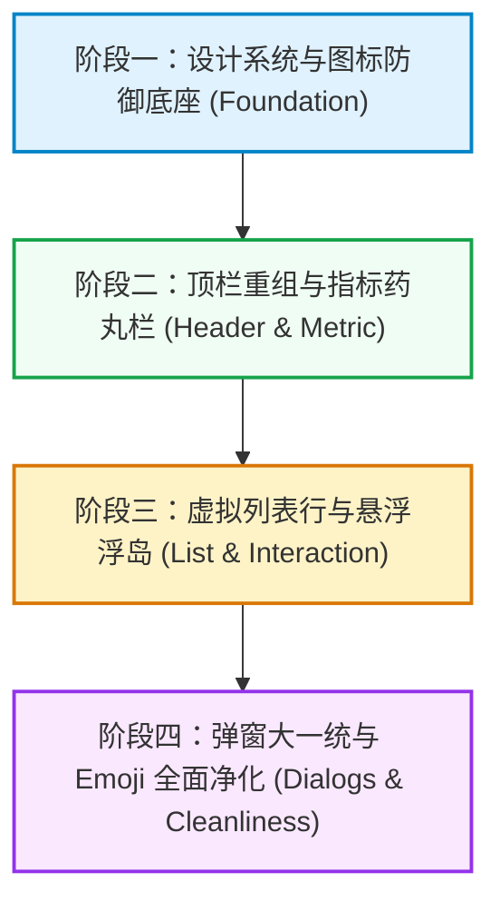

# 资源管家 UI/UX 全面重构与主题自适应设计规范

> **审视视角**：从业多年的互联网应用与桌面生产力工具 UX 资深设计师  
> **适用项目**：思源笔记资源管家插件 (`siyuan-assets-manager`)  
> **文档定位**：插件全界面视觉规范、交互范式与设计系统 Source of Truth  
> **核心原则**：高信噪比、桌面级生产力、拒绝 AI Slop、思源宿主原生融合、亮暗双模完美自适应  

---

## 目录

- [一、现状诊断与反模式剖析](#一现状诊断与反模式剖析)
  - [1.1 核心体验与设计反模式](#11-核心体验与设计反模式)
  - [1.2 拒绝平庸的“AI Slop”设计](#12-拒绝平庸的ai-slop设计)
- [二、设计系统哲学与令牌架构 (Design Tokens)](#二设计系统哲学与令牌架构-design-tokens)
  - [2.1 设计哲学：桌面工具的秩序美学](#21-设计哲学桌面工具的秩序美学)
  - [2.2 间距、排版与层级令牌](#22-间距排版与层级令牌)
- [三、图标系统工程化与思源 CSS 污染绝对防御](#三图标系统工程化与思源-css-污染绝对防御)
  - [3.1 思源 CSS 强污染机理诊断](#31-思源-css-强污染机理诊断)
  - [3.2 线框图标防御架构规范](#32-线框图标防御架构规范)
  - [3.3 彻底杜绝 Emoji 乱用，建立专业矢量语义图标库](#33-彻底杜绝-emoji-乱用建立专业矢量语义图标库)
- [四、亮暗双主题自适应色彩体系 (WCAG 2.1 AA+)](#四亮暗双主题自适应色彩体系-wcag-21-aa)
  - [4.1 色彩令牌映射与对比度矩阵](#41-色彩令牌映射与对比度矩阵)
  - [4.2 消除硬编码颜色，拥抱动态混色 (color-mix)](#42-消除硬编码颜色拥抱动态混色-color-mix)
  - [4.3 六大资源分类色彩矩阵 (Light vs Dark)](#43-六大资源分类色彩矩阵-light-vs-dark)
- [五、工具栏与操作按钮革新：直观图标 + Tooltip 规范](#五工具栏与操作按钮革新直观图标--tooltip-规范)
  - [5.1 按钮交互规范与尺寸节奏](#51-按钮交互规范与尺寸节奏)
  - [5.2 统一思源原生 Tooltip (b3-tooltips) 体系](#52-统一思源原生-tooltip-b3-tooltips-体系)
  - [5.3 顶栏与操作区重构设计方案](#53-顶栏与操作区重构设计方案)
- [六、信息架构与核心组件重构](#六信息架构与核心组件重构)
  - [6.1 顶部指标轻量化：从大砖块到“高集成药丸栏 (Metric Pills)”](#61-顶部指标轻量化从大砖块到高集成药丸栏-metric-pills)
  - [6.2 资源列表行视觉流与渐进式呈现 (Progressive Disclosure)](#62-资源列表行视觉流与渐进式呈现-progressive-disclosure)
  - [6.3 悬浮批量操作浮岛 (Floating Batch Action Dock)](#63-悬浮批量操作浮岛-floating-batch-action-dock)
  - [6.4 弹窗系统架构大一统 (Unified Modal Architecture)](#64-弹窗系统架构大一统-unified-modal-architecture)
- [七、实施路线图与验收核对清单](#七实施路线图与验收核对清单)
  - [7.1 阶段实施计划 (Phased Roadmap)](#71-阶段实施计划-phased-roadmap)
  - [7.2 质量验收核对表 (Pre-Delivery Checklist)](#72-质量验收核对表-pre-delivery-checklist)

---

## 一、现状诊断与反模式剖析

作为资深桌面效率软件设计师，在深度走查 `siyuan-assets-manager` 的当前代码实现后，可以看到本项目具备非常优秀的底层工程能力（如基于虚拟滚动的双视图列表、位图+矢量图层的二次编辑技术、增量哈希/视觉相似度去重算法、安全回收站与撤回引擎）。然而，UI 与交互层目前依然残留着明显的**“原型期拼接感”**与**“工程师思维产物”**，与高水准的商业级桌面生产力工具（如 Linear, Raycast, VS Code, Figma）相比，存在诸多影响使用体验的痛点。

### 1.1 核心体验与设计反模式

| 维度 | 当前问题表现 | 设计师诊断 (Root Cause) |
|---|---|---|
| **图标一致性** | 部分使用 Lucide 组件，部分硬编码内联 `<svg>`，部分随意混入 Emoji（如 `⚠️`、`✨`、`📄`、`✅`）。思源主题切换时，部分线框图标被强制填满为实心黑坨/白坨。 | 缺乏全局图标封装层；未对抗思源全局 `svg { fill: currentColor }` 样式污染；缺乏对系统级 Emoji 跨平台显示不可控的认知。 |
| **操作按钮** | 顶栏按钮混搭：有的纯文字（“去重”、“清理”），有的图文混排（“日志”），有的条件变化（“刷新”在 loading 时转圈平时纯文字）。行内操作按钮则全为纯图标，风格分裂。 | 缺乏统一的按钮形态规范（Button Hierarchy）。没有做到“**以直观图标为主要形体，以即时准确的 Tooltip 为认知补充**”的效率原则。 |
| **主题自适应** | 代码中存在大量写死的硬编码颜色（如 `#10b981`、`#3b82f6`、`#ef4444`、`#d97706`、`rgba(66, 133, 244, ...)`、`#282828`）。在暗色主题或第三方非蓝色系主题（如绿调 Asri、暖调 Savor）下极其刺眼或脱节。 | 未充分利用思源官方的 `--b3-theme-*` 设计变量与现代 CSS `color-mix()`，没有建立明暗双模式色彩适配矩阵。 |
| **空间与布局** | 顶部 Header 塞入了标题、统计、模式切换、搜索框、过滤下拉、文档模式专属排序、4个操作按钮，一旦窗口宽度小于 1050px，发生参差不齐的折行，严重挤压主内容视口。 | 缺乏响应式断点编排和功能分区意识。未将“全局统计”、“过滤检索”与“批量动作”解耦。 |
| **信息过载** | 列表内每一行在默认静止状态下都完整展示 4 个操作按钮（外链、编辑、重命名、删除），整屏呈现数十个重复小图标，产生大量高频视觉噪声（Visual Noise）。 | 缺乏渐进式呈现（Progressive Disclosure）交互意识。高效表格应采用“悬停凸显/聚焦展开”模式。 |
| **弹窗与反馈** | 各弹窗样式各自为政（`DeletionHistoryDialog` 与 `DeduplicateDialog` 类名风格完全脱节）；删除多选文件时，用户视线在列表底部，操作按钮却远在顶栏右上角。 | 缺乏全局弹窗容器继承体系与就近操作原则（Proximity Principle）。 |

### 1.2 拒绝平庸的“AI Slop”设计

近年来各类由基础大模型生成的 UI 方案存在严重的 **“AI Slop”**（粗制滥造的 AI 平庸设计）：
1. **滥用毛玻璃与渐变色**：随意使用 `backdrop-filter: blur()` 与高饱和紫粉蓝渐变，在性能上导致页面滚动丢帧，在视觉上破坏了笔记工具所追求的“内容第一”专注感；
2. **缺乏视觉层级的灰色文字**：在深浅背景上盲目套用 `text-gray-400` / `#888`，文字对比度低于 3:1，使普通视力用户阅读极其吃力；
3. **假“现代感”的浮夸大圆角与巨大留白**：盲目使用 `rounded-2xl`（16px+）和 24px+ 边距，极大浪费桌面屏效，使本应承载大量资产信息的列表沦为低信息密度的玩具；
4. **Emoji 冒充 UI 图标**：偷懒使用系统 Emoji，在 Windows 显示为硬质矢量卡通、在 macOS 显示为拟物渐变，导致应用在不同操作系统上出现撕裂的杂乱感。

**本方案的坚持**：坚决摒弃上述 AI Slop 恶习。我们采用**紧凑克制的现代桌面设计语言（Modern Desktop Utility）**——依靠精准的网格对齐、清晰的字阶对比、严谨的线框图标、轻量高效的状态动效，构建一款让重度笔记用户感到**极度顺手、清爽专业**的高效生产力工具。

---

## 二、设计系统哲学与令牌架构 (Design Tokens)

### 2.1 设计哲学：桌面工具的秩序美学

- **工具透明性 (Instrumental Transparency)**：UI 的存在是为了辅助用户快速管理数以万计的笔记资源，而不是炫耀界面本身。界面背景应当后退，操作引导应当精准；
- **思源原生融合 (Host-Native Affinity)**：插件应当像思源原生自带的核心模块一样自然，完美兼容思源默认亮暗色及一切社区主题；
- **高密度与可呼吸感并存 (Dense yet Breathable)**：保证单屏显示至少 10~15 条资源，同时利用 4px 微间距与文字权重划分层级，保证视觉不拥挤、不视觉疲劳。

### 2.2 间距、排版与层级令牌

在 `src/index.scss` 中构建统一设计令牌体系，全面规范组件尺寸、字号、圆角和层级：

```scss
// ===== 1. 基础尺寸与间距令牌 (基于 4px 韵律) =====
$spacing-xxs: 2px;
$spacing-xs:  4px;
$spacing-sm:  8px;
$spacing-md:  12px;
$spacing-lg:  16px;
$spacing-xl:  24px;

// ===== 2. 交互组件标准化高度 =====
$height-control-sm: 26px; // 列表内紧凑控件
$height-control-md: 30px; // 工具栏标准控件 (按钮/输入框/下拉)
$height-control-lg: 36px; // 弹窗主 CTA / 大按钮

// ===== 3. 圆角系统 (克制、严谨) =====
$radius-xs: 3px;  // 徽章、微型标签
$radius-sm: 4px;  // 按钮、输入框、下拉框
$radius-md: 6px;  // 卡片、次级容器、药丸按钮
$radius-lg: 8px;  // 弹窗主视窗、预览卡片

// ===== 4. 字阶与字重系统 =====
$font-size-badge: 10px; // 微标
$font-size-xs:    11px; // 次要元数据 (时间/体积/后缀)
$font-size-sm:    12px; // 辅助说明/标签
$font-size-base:  13px; // 列表正文、控件文本、输入框
$font-size-md:    14px; // 区块小标题、强调文字
$font-size-lg:    16px; // 弹窗标题
$font-size-xl:    18px; // 主视图标题

$font-weight-normal: 400;
$font-weight-medium: 500;
$font-weight-semibold: 600;
$font-weight-bold:   700;

// ===== 5. 严格分层的 Z-Index 体系 =====
$z-base:        1;
$z-dropdown:    50;
$z-sticky-bar:  100;
$z-dock-island: 500;  // 底部悬浮批量操作浮岛
$z-tooltip:     800;
$z-modal:       1000; // 普通弹窗 (去重/历史/编辑)
$z-modal-top:   1500; // 嵌套弹窗 / 裁剪浮层
$z-confirm:     3000; // 最高优先级确认对话框 (阻塞操作)
$z-preview:     5000; // 悬浮大图预览 (凌驾于一切列表之上)

// ===== 6. 动效时间令牌 (快速、平滑、无迟滞) =====
$motion-fast:   120ms cubic-bezier(0.4, 0, 0.2, 1);
$motion-normal: 180ms cubic-bezier(0.4, 0, 0.2, 1);
$motion-smooth: 240ms cubic-bezier(0, 0, 0.2, 1);
```

---

## 三、图标系统工程化与思源 CSS 污染绝对防御

### 3.1 思源 CSS 强污染机理诊断

在思源插件开发中，图标显示异常是一个极为高发但常常被忽视的**严重暗坑**。其根源在于：

1. 思源原生界面及大部分社区流行主题（如 Savor、Asri、Sofun、Tsundoku 等），为了让官方自带的图标（多为内联 SVG）跟随文字变色，常常在全局样式表中写下了高权重的强制覆盖规则：
   ```css
   /* 思源全局样式或主题样式中的激进规则 */
   svg {
     fill: currentColor !important;
   }
   .b3-button svg,
   .b3-dialog svg,
   .b3-list-item svg {
     fill: currentColor !important;
   }
   ```
2. 当插件引入 **Lucide** 等现代矢量线框图标库时，其设计语言是 **Stroke 轮廓构形**（`fill: none`, `stroke: currentColor`, `stroke-width: 2`）。
3. 一旦上述思源全局规则生效，线框图标的镂空区域被强行填满 `currentColor`，导致**羽毛笔变成黑块、垃圾桶变成黑方砖、撤销箭头变成实心扇形、折叠箭头变成黑色三角形**，UI 彻底报废。

### 3.2 线框图标防御架构规范

为了彻底根除该问题，必须建立**“行内样式强防御 + 全局深度穿透双保险机制”**：

#### 规则 1：内联 SVG 元素防御原则
所有的 `<svg>` 标签，必须显式携带 `style="fill: none !important;"`（或内联 `fill="none"` 并在全局 CSS 中对所有插件域内的 SVG 做防御）。

#### 规则 2：Vue 组件封装与工具指令
建立全局防污染图标组件 `<AmIcon>` 或为 Lucide 图标统一配置样式：

```vue
<!-- src/components/common/AmIcon.vue -->
<template>
  <component
    :is="icon"
    :size="size"
    :stroke-width="strokeWidth"
    class="am-icon"
    :style="{ fill: 'none !important' }"
  />
</template>

<script setup lang="ts">
import type { Component } from 'vue';

withDefaults(
  defineProps<{
    icon: Component;
    size?: number;
    strokeWidth?: number;
  }>(),
  {
    size: 16,
    strokeWidth: 2,
  }
);
</script>

<style scoped lang="scss">
.am-icon {
  display: inline-block;
  vertical-align: middle;
  flex-shrink: 0;
  fill: none !important;
  stroke: currentColor !important;
}
</style>
```

#### 规则 3：全局 SCSS 强力防御屏障
在 `src/index.scss` 中加入最高权重防御块，覆盖所有可能被思源宿主穿透的路径：

```scss
// ===== 线框图标免疫防御层 (Anti-Pollution Shield) =====
.siyuan-assets-manager-app,
.assets-manager-container,
.am-dialog,
.am-tab-container,
.am-modal-dialog {
  svg,
  .lucide,
  svg.lucide {
    fill: none !important;
    stroke: currentColor !important;
    stroke-linecap: round;
    stroke-linejoin: round;

    // 严禁思源全局 path 填充覆盖
    path, circle, rect, line, polyline, polygon {
      &:not([data-allow-fill]) {
        fill: none !important;
      }
    }
  }
}
```

### 3.3 彻底杜绝 Emoji 乱用，建立专业矢量语义图标库

全面清查并替换项目内现存的 Emoji 混用，统一收口至标准化 Lucide 矢量线框图标：

| 原 Emoji / 裸标签 | 所在组件与位置 | 替换为标准化 Lucide 图标 | 视觉寓意与交互反馈 |
|---|---|---|---|
| `⚠️` | `ConfirmDialog.vue` (标题前缀) | `<AlertTriangle :size="18" />` | 统一警示轮廓，色值绑定 `--b3-theme-error` |
| `✨` | `DeduplicateDialog.vue` (空状态) | `<Sparkles :size="32" />` | 优雅的空状态微标，静谧洁净感知 |
| `📄` | `DeduplicateDialog.vue` (引用文档路径) | `<FileText :size="13" />` | 严谨的文档元数据标示 |
| `✅` | `DeduplicateDialog.vue` (已合并提示) | `<CheckCircle2 :size="14" />` | 绿调成功状态徽标 |
| `↑` / `↓` 文本 | `VirtualAssetList.vue` (表头排序) | `<ArrowUp :size="12" />` / `<ArrowDown :size="12" />` | 消除文本箭头的不规整字符宽度，规整对齐 |
| `...` 文本 | `VirtualAssetList.vue` (加载占位) | `<Loader2 :size="16" class="spinning" />` | 标准微动效载入状态 |

---

## 四、亮暗双主题自适应色彩体系 (WCAG 2.1 AA+)

### 4.1 色彩令牌映射与对比度矩阵

一款合格的桌面插件绝不能有一套自己独立的写死调色板。它必须**完全依赖思源笔记的核心主题变量**。同时，需要解决思源原生变量在某些极端高对比或低对比主题下层级不够丰富的问题。

通过 CSS `color-mix()` 技术，我们可以优雅地从思源基础色派生出具备完美透明度与对比度的功能色阶：

```scss
:root {
  // ===== 插件语义化自适应表面与边框 =====
  // 1. 悬浮底色：在亮色下产生柔和浅灰，在暗色下产生轻微微光
  --am-surface-hover: color-mix(in srgb, var(--b3-theme-on-surface) 6%, transparent);
  --am-surface-active: color-mix(in srgb, var(--b3-theme-on-surface) 10%, transparent);
  
  // 2. 选中态背景色：基于当前主题高亮色 (完美兼容任何第三方主题颜色，无论蓝/绿/紫/橙)
  --am-primary-subtle: color-mix(in srgb, var(--b3-theme-primary) 12%, transparent);
  --am-primary-hover: color-mix(in srgb, var(--b3-theme-primary) 18%, transparent);
  --am-primary-border: color-mix(in srgb, var(--b3-theme-primary) 40%, transparent);

  // 3. 危险与警告色阶
  --am-error-subtle: color-mix(in srgb, var(--b3-theme-error) 10%, transparent);
  --am-error-hover: color-mix(in srgb, var(--b3-theme-error) 16%, transparent);
  --am-error-border: color-mix(in srgb, var(--b3-theme-error) 35%, transparent);

  // 4. 标准卡片与边框
  --am-border-subtle: color-mix(in srgb, var(--b3-border-color, var(--b3-theme-surface-lighter)) 70%, transparent);
  --am-border-strong: var(--b3-border-color, var(--b3-theme-surface-lighter));
}
```

### 4.2 消除硬编码颜色，拥抱动态混色 (color-mix)

彻底消除原代码中的固定颜色，以下为典型的**重构映射规范**：

| 原代码写死颜色 | 所在位置 | 存在隐患 | 重构后自适应规范 |
|---|---|---|---|
| `rgba(66, 133, 244, 0.15)` | `AssetsManager` 选中与卡片高亮 | 在暗色或非蓝色主题下严重割裂突兀 | `var(--am-primary-subtle)` (动态混合主题色) |
| `#d97706` (深琥珀色) | `VirtualAssetList` 底图徽章与图标 | 暗色背景下对比度仅 3.1:1，阅读极其吃力 | `var(--am-badge-original-color)`（明暗模式动态分级） |
| `#282828` | `ImageEditorDialog` 画布外边框背景 | 亮色模式下生硬如黑洞 | 画布工作区保持专业暗灰（`#1f1f23`），弹窗外框采用 `var(--b3-theme-surface)` |
| `rgba(239, 68, 68, 0.15)` | `audio-muted-badge` 音频静音红标 | 仅适配默认浅色，暗色下过于荧光 | `var(--am-error-subtle)` + `var(--b3-theme-error)` |
| `#10b981`, `#3b82f6` 等 | 顶部 6 大分类卡片图标色 | 暗色下未降饱和度，产生视觉眩晕 | 采用 CSS 变量分级管理（见下节） |

### 4.3 六大资源分类色彩矩阵 (Light vs Dark)

在桌面工具中，文件分类图标颜色是用户快速辨识文件属性的重要心理锚点。但高纯度颜色在纯黑背景下会发虚，在纯白背景下会过淡。因此，我们必须为亮暗模式配置**经过对比度调优的专属色卡**：

```scss
// ===== 分类色彩体系：双模式自适应 =====
:root {
  // 亮色模式：深沉稳重，对比度 >= 4.8:1
  --am-cat-all:      var(--b3-theme-primary);
  --am-cat-image:    #059669; // 翠绿 (Emerald 600)
  --am-cat-doc:      #2563eb; // 蓝 (Blue 600)
  --am-cat-audio:    #d97706; // 琥珀橙 (Amber 600)
  --am-cat-video:    #dc2626; // 玫瑰红 (Red 600)
  --am-cat-archive:  #7c3aed; // 紫罗兰 (Violet 600)
}

// 适配思源暗色主题 (通过思源全局 html[data-theme-mode="dark"] 自动切换)
html[data-theme-mode="dark"] {
  // 暗色模式：轻微降饱和度，提高明度，对比度 >= 5.5:1
  --am-cat-all:      var(--b3-theme-primary);
  --am-cat-image:    #34d399; // 亮浅绿 (Emerald 400)
  --am-cat-doc:      #60a5fa; // 浅天蓝 (Blue 400)
  --am-cat-audio:    #fbbf24; // 浅暖琥珀 (Amber 400)
  --am-cat-video:    #f87171; // 浅珊瑚红 (Red 400)
  --am-cat-archive:  #a78bfa; // 浅薰衣草紫 (Violet 400)
}
```

---

## 五、工具栏与操作按钮革新：直观图标 + Tooltip 规范

### 5.1 按钮交互规范与尺寸节奏

用户提出核心要求：“**操作按钮尽量采用直观图标+tooltip方式呈现**”。  
在资深 UX 设计师看来，桌面效率工具的工具栏应当追求：**最小视觉负担、最大点击直觉、零歧义认知**。

#### 按钮视觉规范
1. **纯图标操作按钮 (`.am-btn--icon`)**：
   - 尺寸：`28px × 28px`（工具栏）或 `26px × 26px`（行内操作）；
   - 外观：默认透明底色，无突兀边框；
   - 交互态：
     - Hover：`background-color: var(--am-surface-hover); color: var(--b3-theme-on-surface); transform: translateY(-1px);`
     - Active：`background-color: var(--am-surface-active); transform: translateY(0);`
     - Focus-Visible：`box-shadow: 0 0 0 2px var(--b3-theme-primary);`
2. **破坏性危险图标按钮 (`.am-btn--icon-danger`)**：
   - 默认保持低饱和或次要文本色，仅在 Hover 时激活红色：
     - Hover：`background-color: var(--am-error-subtle); color: var(--b3-theme-error);`
     - Active：`background-color: var(--am-error-hover);`
3. **带状态指示的切换按钮 (`.am-btn--toggle`)**：
   - 激活时带有沉浸式主题色背景与反白文字，明确表明当前工作模式（如平铺视图 vs 文档视图）。

### 5.2 统一思源原生 Tooltip (`b3-tooltips`) 体系

彻底淘汰 HTML 原生的 `title` 属性（该属性存在三大硬伤：系统级 1.5 秒延迟才弹出、外观为难看的老旧黄色/纯黑边框、无法自定义布局与快捷键）。

全量迁移至思源官方的 `b3-tooltips` 规范，并在 `src/index.scss` 中补充边界自适应保护：

```html
<!-- 标准图标按钮 + 思源原生 Tooltip 示例 -->
<button
  class="am-btn am-btn--icon b3-tooltips b3-tooltips__s"
  aria-label="刷新资源列表 (R)"
  @click="handleRefreshClick"
>
  <RotateCw :size="15" :class="{ 'spinning': loading }" />
</button>
```

#### Tooltip 文案规范公式
$$\text{Tooltip 内容} = \text{动词短语 (准确操作意图)} + \text{ [快捷键提示 / 关键后果说明]}$$

- 刷新按钮：`刷新资源列表 (R)`
- 视图切换（平铺）：`切换为平铺列表视图`
- 视图切换（文档）：`切换为按文档归类视图`
- 智能去重：`智能去重：扫描精确重复与视觉相似资源`
- 未引用清理：`综合清理：扫描未被任何文档引用的孤儿文件`
- 操作审计：`审计日志：查看删除历史与引用回退`
- 行内编辑：`在编辑器中打开并编辑此图片`
- 行内重命名：`重命名此资源 (自动同步所有文档引用)`
- 行内删除：`删除此资源及关联文档引用 (Delete)`

### 5.3 顶栏与操作区重构设计方案

当前 `AssetsManager.vue` 顶栏元素严重堆积，在大屏下尚可，在小屏/页签面板下立即折行错乱。

#### 全新两段式弹性布局结构：
- **第一层 (Brand & Global Status Bar)**：
  - 左侧：插件标题（`资源管家`） + 极简实时指标胶囊（`1,420 资源 · 284 MB`）；
  - 右侧：上次刷新时间小字 + 顶栏高频操作图标组（`刷新` · `去重` · `清理` · `日志`）；
- **第二层 (Filter & View Toolbar)**：
  - 左侧：视图切换药丸组（平铺 / 文档） + 复合搜索框（内嵌放大镜线框图标与清除按键）；
  - 中间：属性筛选下拉（全部 / 可编辑 / 底图 / 未引用 / 大文件）；
  - 右侧（文档模式专属）：文档卡片排序下拉 + 升降序切换图标 + 全部折叠/展开图标。

```
┌─────────────────────────────────────────────────────────────────────────────┐
│ 资源管家  [1,420 资源 · 284 MB]                  上次刷新 19:35   [↻] [⊞] [✨] [⏱] │ ← Top Bar
├─────────────────────────────────────────────────────────────────────────────┤
│ [ ≡ | ⑉ ]  [🔍 搜索资源名称...       (x)]  [全部属性 ▾]    [按总大小 ▾] [↓] [⇕] │ ← Action Bar
└─────────────────────────────────────────────────────────────────────────────┘
```

这种两段式结构保证了**永远不会发生不可控的错位折行**，界面节奏严密规整。

---

## 六、信息架构与核心组件重构

### 6.1 顶部指标轻量化：从大砖块到“高集成药丸栏 (Metric Pills)”

#### 现状弊端
当前 6 个分类卡片（`全部`、`图片`、`文档`、`音频`、`视频`、`压缩包`）每个都是一个独立的方块，纵向占用近 70px 空间，且信息分布松散。

#### 重构设计方案：Segmented Metric Pills（分段指标药丸栏）
将分类卡片重构为一组连贯紧凑的水平胶囊药丸（高度压缩至 `32px`），集成图标、分类名、数量与体积：

```html
<div class="category-pills-bar">
  <button
    v-for="card in categoryCards"
    :key="card.key"
    class="category-pill"
    :class="{ 'is-active': activeCategory === card.key }"
    @click="handleCategoryClick(card.key)"
  >
    <component :is="card.icon" :size="14" class="pill-icon" />
    <span class="pill-label">{{ card.label }}</span>
    <span class="pill-badge">{{ categoryStats[card.key]?.count || 0 }}</span>
    <span class="pill-size">{{ categoryStats[card.key]?.sizeText || '0 B' }}</span>
  </button>
</div>
```

```scss
.category-pills-bar {
  display: flex;
  align-items: center;
  gap: 6px;
  margin-bottom: 12px;
  overflow-x: auto;
  padding-bottom: 2px;

  &::-webkit-scrollbar {
    height: 3px;
  }
}

.category-pill {
  height: 30px;
  padding: 0 10px;
  border-radius: 15px;
  border: 1px solid var(--am-border-subtle);
  background: var(--b3-theme-background-light);
  color: var(--b3-theme-on-surface);
  display: inline-flex;
  align-items: center;
  gap: 6px;
  font-size: 12px;
  cursor: pointer;
  white-space: nowrap;
  transition: all $motion-fast;
  user-select: none;

  &:hover {
    background: var(--am-surface-hover);
    border-color: var(--b3-theme-primary);
    transform: translateY(-1px);
  }

  &.is-active {
    background: var(--am-primary-subtle);
    border-color: var(--b3-theme-primary);
    color: var(--b3-theme-primary);
    font-weight: 600;

    .pill-badge {
      background: var(--b3-theme-primary);
      color: var(--b3-theme-on-primary);
    }
  }

  .pill-icon {
    fill: none !important;
    stroke: currentColor !important;
  }

  .pill-badge {
    padding: 1px 5px;
    border-radius: 8px;
    background: var(--am-surface-active);
    font-size: 11px;
    font-variant-numeric: tabular-nums;
  }

  .pill-size {
    font-size: 11px;
    opacity: 0.7;
    font-variant-numeric: tabular-nums;
  }
}
```

> **效果提升**：为列表区域节省出至少 `40px` 的垂直视口（相当于多展示一条完整资源）；同时水平滚动适配任何窗口宽度。

---

### 6.2 资源列表行视觉流与渐进式呈现 (Progressive Disclosure)

#### 现状弊端
当前列表中，每一行末尾的 4 个图标按钮（定位文档、编辑、重命名、删除）在未悬停时全都直接展示。当可视区域有 12 条资源时，视线里同时排列着 48 个小图标，造成严重的视觉混乱。

#### 渐进式呈现规范 (Progressive Disclosure)
1. **默认状态 (Rest State)**：
   - 隐藏非核心操作，仅保留一个更平淡的操作占位符，或者将操作按钮的 `opacity` 降至 `0.15`（隐约可见可点击性）；
2. **行悬停状态 (Hover State)**：
   - 整行背景微亮（`background: var(--am-surface-hover)`）；
   - 操作按钮平滑浮现（`opacity: 1; transition: opacity $motion-fast;`）；
   - 文件名文本微高亮，指示当前鼠标行；
3. **行选中状态 (Selected State)**：
   - 背景使用主题混合浅底色（`var(--am-primary-subtle)`）；
   - 左侧复选框勾选，整行操作按钮保持可用。

---

### 6.3 悬浮批量操作浮岛 (Floating Batch Action Dock)

#### 现状体验痛点
当前用户在列表中按 Shift 或 Ctrl 勾选了数十个孤儿文件后，准备批量清理，却发现操作按钮在**最顶部的右上角**。长列表浏览时用户的视线和鼠标通常在屏幕中下方，这种“视线大范围来回奔波”是典型的 Fitts's Law（菲茨定律）反模式。

#### 浮岛重构设计：Floating Action Dock
当 `selectedNames.size > 0` 时，在列表正下方居中平滑滑入一个精致的胶囊悬浮岛：

```
┌───────────────────────────────────────────────────────────────┐
│  已选中 12 个资源 (4.2 MB)  │  [全选]  [反选]  [清空]  │  [🗑 批量删除]  │
└───────────────────────────────────────────────────────────────┘
```

- **出现动效**：`transform: translateY(20px) scale(0.95); opacity: 0;` $\to$ `transform: translateY(0) scale(1); opacity: 1;`（耗时 180ms）；
- **人机工效**：紧贴用户鼠标核心作业区，一键执行高破坏性操作时带有明确的二次确认阻断保护。

---

### 6.4 弹窗系统架构大一统 (Unified Modal Architecture)

目前插件内的弹窗存在命名和结构脱节：
- `ConfirmDialog.vue`：简单 Teleport
- `DeduplicateDialog.vue`：巨型弹窗，内联了扫描横幅、分栏列表与比对画廊
- `DeletionHistoryDialog.vue`：独立的 `.am-modal-mask` / `.am-modal-dialog`
- `ImageEditorDialog.vue`：全屏图片编辑

#### 弹窗骨架统一规范

所有模态弹窗统一继承如下 DOM 与 CSS 结构：

```html
<div class="am-dialog-overlay" @click.self="handleMaskClick">
  <div class="am-dialog am-dialog--[size]" role="dialog" aria-modal="true">
    <!-- 统一弹窗头 -->
    <header class="am-dialog__header">
      <div class="am-dialog__title-box">
        <AmIcon :icon="DialogIcon" :size="18" class="dialog-title-icon" />
        <h3>{{ title }}</h3>
        <span v-if="badgeText" class="am-dialog__badge">{{ badgeText }}</span>
      </div>
      <button class="am-btn am-btn--icon b3-tooltips b3-tooltips__sw" aria-label="关闭窗口 (Esc)" @click="handleClose">
        <X :size="16" />
      </button>
    </header>

    <!-- 弹窗主体区 -->
    <main class="am-dialog__body">
      <slot />
    </main>

    <!-- 统一弹窗底 -->
    <footer class="am-dialog__footer">
      <div class="footer-meta">
        <slot name="meta" />
      </div>
      <div class="footer-actions">
        <button class="am-btn am-btn--ghost" @click="handleClose">取消</button>
        <button class="am-btn am-btn--primary" :class="{ 'am-btn--danger': isDangerAction }" @click="handleConfirm">
          {{ confirmText }}
        </button>
      </div>
    </footer>
  </div>
</div>
```

---

## 七、实施路线图与验收核对清单

### 7.1 阶段实施计划 (Phased Roadmap)



1. **阶段一：设计系统与图标防御底座 (Foundation)**
   - 重构 `src/index.scss`：注入完整的间距、字阶、Z-Index、动画令牌体系与 `color-mix()` 混色变量；
   - 建立线框图标绝对防御屏障（全局覆盖与 `<AmIcon>` 或防护机制），验证思源全局 `svg { fill: currentColor }` 覆盖场景；
2. **阶段二：顶栏重组与指标药丸栏 (Header & Metric)**
   - 重构 `AssetsManager.vue` 顶栏为弹性两层结构，消除折行问题；
   - 将 6 大分类大卡片改为 30px 高度的 Segmented Metric Pills 药丸栏，节省 40px 纵向高度；
   - 将操作按钮（刷新、去重、清理、日志）重构为纯线框图标 + `b3-tooltips`；
3. **阶段三：虚拟列表行与悬浮浮岛 (List & Interaction)**
   - 优化 `VirtualAssetList.vue` 与 `DocumentAssetGroupList.vue` 的行 Hover 反馈；
   - 实行操作列渐进式展示（Progressive Disclosure），减少 75% 的静止期视觉噪声；
   - 实现底部悬浮批量操作浮岛（Floating Batch Action Dock），支持就近批处理；
4. **阶段四：弹窗大一统与 Emoji 全面净化 (Dialogs & Cleanliness)**
   - 清除全部组件内的 Emoji 滥用，替换为标准化 Lucide 线框图标；
   - 对齐 `DeletionHistoryDialog.vue` 与 `DeduplicateDialog.vue` 的弹窗类名、按钮、滑块及主题适配；
   - 全面验证亮色与暗色模式下的文字对比度。

---

### 7.2 质量验收核对表 (Pre-Delivery Checklist)

在落地任何 UI 优化或提测前，必须逐项核对以下硬性指标：

#### 视觉与图标规范
- [ ] 所有 UI 图标均为标准矢量线框图标（Lucide），无一处遗留 Emoji 充当操作图标；
- [ ] 所有 `<svg>` 节点均具备显式 `fill: none !important;` 保护，在思源任何第三方主题下不出现黑坨/白坨实心填充；
- [ ] 交互图标尺寸统一为 `14px` 或 `16px`，图标按钮点击热区不小于 `26px × 26px`；
- [ ] 杜绝未经设计的渐变色与过度毛玻璃效果，界面背景克制、沉稳。

#### 亮暗模式与文字对比度
- [ ] 核心正文（文件名、标题、主要属性）对比度在亮色与暗色下均达到 `7:1` 以上；
- [ ] 次要文本（更新时间、文件体积、路径、统计说明）对比度满足 WCAG 2.1 AA 标准（$\ge 4.5:1$）；
- [ ] 彻底移除写死的 HEX 颜色（如 `#10b981`、`#3b82f6`、`#d97706`），全量采用 `color-mix()` 与思源主题变量；
- [ ] 在思源自带 Daylight（明亮）、Dark+（暗黑）以及社区高饱和度主题下无视觉断层。

#### 交互与人机工效
- [ ] 所有非自解释型操作按钮均配备思源原生 `b3-tooltips`，靠右侧按钮带有防溢出定位；
- [ ] 列表多选时具备就近交互反馈，支持快捷键（Shift 连选、Ctrl 多选、Ctrl+A 全选、Delete 批删）；
- [ ] 异步操作（如刷新、去重扫描、批量归一化）具备不可重复提交阻断与平滑旋转状态；
- [ ] 所有模态弹窗均支持 Esc 快捷键关闭，且事件冒泡被完全拦截，不误触思源底层的全局撤销或快捷命令。
